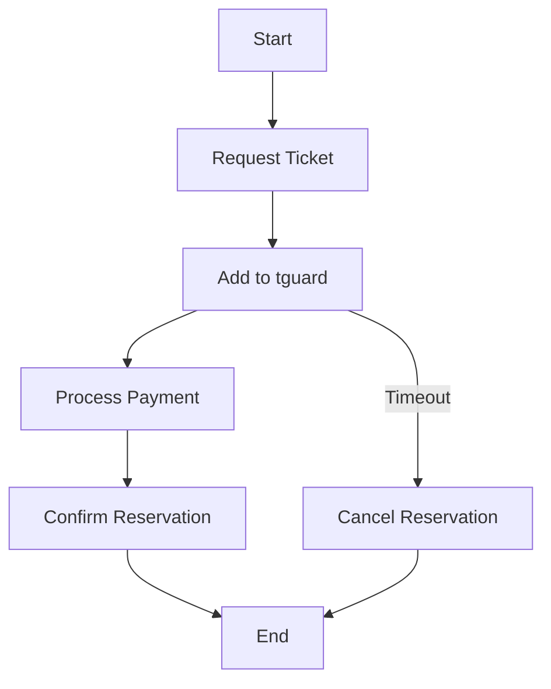

# tguard (time guard) Package

The `tguard` package is designed to manage data with specific timeouts. It offers functionalities to start, cancel, and manage data based on their time-to-live (TTL) settings.

## Installation

```bash
go get github.com/9ssi7/tguard
```

## Potential Use-Cases

### Real-World Example: Ticketing System

The `tguard` package can be used in a ticketing system to manage reservations with a specific time limit. Here's a Mermaid diagram illustrating the flow:



## Documentation

[](https://pkg.go.dev/github.com/9ssi7/tguard)

## Usage

### Import the Package

```go
import "github.com/9ssi7/tguard"
```

### Define Your Data Structure

Define the structure of your data, which should include an identifier (`Id`) and any other relevant fields.

```go
type TestData struct {
	Id   string `json:"id"`
	Name string `json:"name"`
}
```

### Implement the Identity Checker

Implement an identity checker function to verify the data's identity.

```go
identityChecker := func(id string, data TestData) bool {
	return id == data.Id
}
```

### Create Configuration

Create a configuration for the `tguard` service, specifying the fallback function, identity checker, default TTL, and interval.

```go
config := tguard.Config[TestData]{
	Fallback:        func(data TestData) {},
	IdentityChecker: identityChecker,
	DefaultTTL:      time.Minute * 5,
	Interval:        time.Second * 10,
}
```

### Create and Start the Service

Create a new `tguard` service instance using the configuration and start the service.

```go
g := tguard.New(config)
ctx := context.Background()
go g.Connect(ctx)
```

### Manage Data

Use the `Start` method to add data and the `Cancel` method to remove data if needed.

```go
data := TestData{
	Id:   "1",
	Name: "test",
}
_ = g.Start(ctx, data)
```

## Full Example

Here's a complete example demonstrating how to use the `tguard` package:

```go
// Import required packages
import (
	"context"
	"time"
	"github.com/9ssi7/tguard"
)

// Define the data structure
type TestData struct {
	Id   string `json:"id"`
	Name string `json:"name"`
}

func main() {
	// Implement the identity checker
	identityChecker := func(id string, data TestData) bool {
		return id == data.Id
	}

	// Create the configuration
	config := tguard.Config[TestData]{
		Fallback:        func(data TestData) {},
		IdentityChecker: identityChecker,
		DefaultTTL:      time.Minute * 5,
		Interval:        time.Second * 10,
	}

	// Create and start the service
	g := tguard.New(config)
	ctx := context.Background()
	go g.Connect(ctx)

	// Manage data
	data := TestData{
		Id:   "1",
		Name: "test",
	}
	_ = g.Start(ctx, data)
}
```

## Without Standart TTL Example

By default, tguard uses the same ttl time for each data. For example, if you set the defaultTTL value to 7 minutes, whatever data comes in will expire 7 minutes after the data is saved.

However, with an update we made, we thought that each data could have its own TTL time. This is especially valuable for survey systems. One user may finish the survey after 5 minutes, another may finish it after 30 minutes.

That's exactly what we're doing in this example.

```go
import (
	"context"
	"time"
	"github.com/9ssi7/tguard"
)

type PollData struct {
	Id   string `json:"id"`
	Name string `json:"name"`
	Options []string `json:"options"`
	EndTime time.Time `json:"end_time"`
}

func main() {
	identityChecker := func(id string, data TestData) bool {
		return id == data.Id
	}

	// Create the configuration
	config := tguard.Config[TestData]{
		Fallback:        func(data TestData) {},
		IdentityChecker: identityChecker,
		Interval:        time.Second * 1,
		WithStandardTTL: false,
	}

	// Create and start the service
	g := tguard.New(config)
	ctx := context.Background()
	go g.Connect(ctx)

	// Manage data
	data := PollData{
		Id:   "1",
		Name: "test",
		Options: []string{"a", "b", "c"},
		EndTime: time.Now().Add(time.Minute * 5),
	}
	_ = g.Start(ctx, data, data.EndTime.Sub(time.Now())) // ttl time is 5 minutes
	
	data2 := PollData{
		Id:   "2",
		Name: "test2",
		Options: []string{"a", "b", "c"},
		EndTime: time.Now().Add(time.Minute * 10),
	}
	_ = g.Start(ctx, data2, data2.EndTime.Sub(time.Now())) // ttl time is 10 minutes
}
```

## Contributing

Pull requests are welcome. For major changes, please open an issue first to discuss what you would like to change.

## License

This project is licensed under the Apache License. See [LICENSE](LICENSE) for more details.